# Data Science Tools and Ecosystem

This repository contains the final assignment for the Data Science Tools and Ecosystem course. The Jupyter notebook titled `DataScienceEcosystem.ipynb` includes examples and descriptions of various data science languages, libraries, tools, and basic arithmetic operations in Python.

## Screenshots of the Notebook

Each step is documented with a corresponding screenshot to show the notebook’s progression.

### 1. Notebook Creation
This screenshot shows the initial creation of the notebook file.

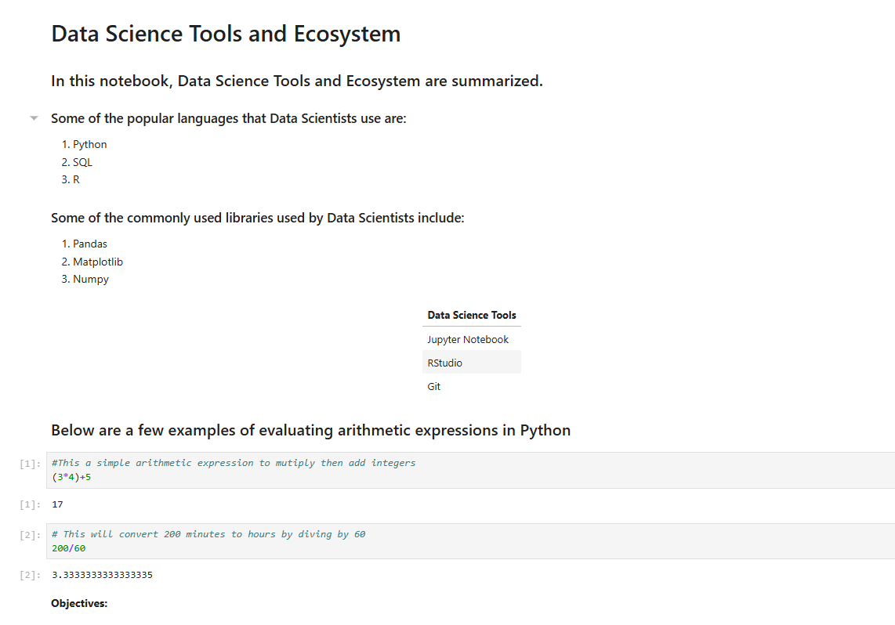

### 2. Title
The title of the notebook in H1 format, showcasing the heading "Data Science Tools and Ecosystem."

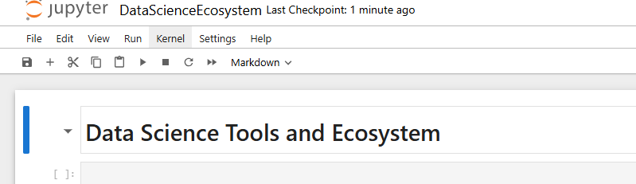

### 3. Introduction
An introductory sentence explaining the content of the notebook.

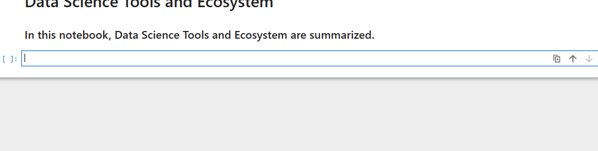

### 4. Data Science Languages
A markdown cell listing popular data science languages in an ordered list.

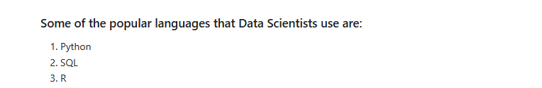

### 5. Data Science Libraries
A markdown cell listing common data science libraries used by professionals.

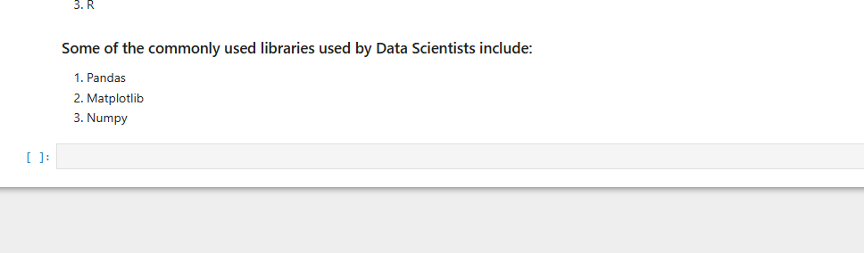

### 6. Data Science Tools
A single-column table showing three popular data science tools.

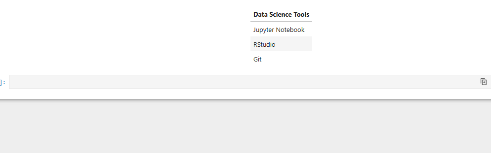

### 7. Arithmetic Expression Introduction
An introduction to arithmetic expressions in Python, formatted with an H3 heading.

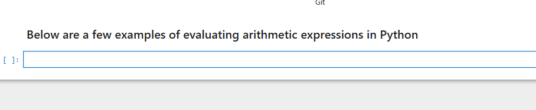

### 8. Multiply and Add Code Cell
A code cell that multiplies and adds numbers, with a comment explaining the operation.

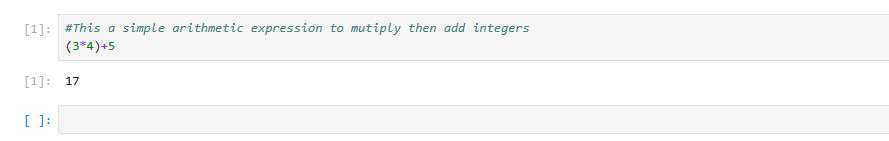

### 9. Convert Minutes to Hours Code Cell
A code cell that converts 200 minutes to hours, with a comment explaining the operation.

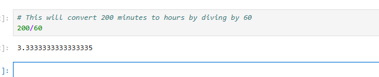

### 10. Objectives
A markdown cell listing the objectives covered in this notebook.

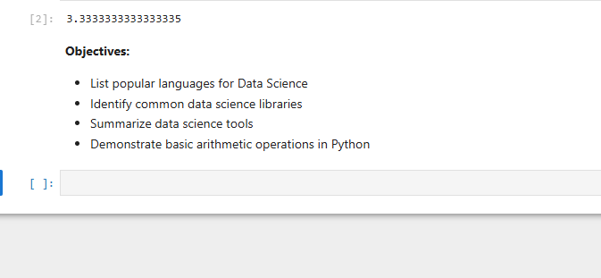

### 11. Author Details
A markdown cell indicating the author's name.

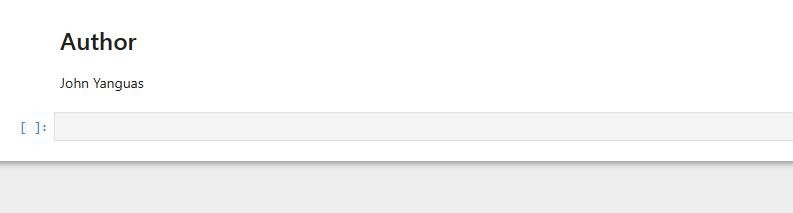

## How to Use this Repository
- Clone this repository to view the notebook.
- To view the notebook on GitHub, click [here](https://github.com/jyanggi/DataScienceEcosystem/blob/main/DataScienceEcosystem.ipynb).

## Author
John Yanguas

